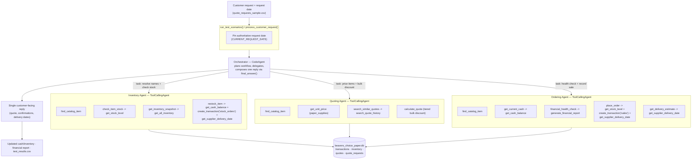
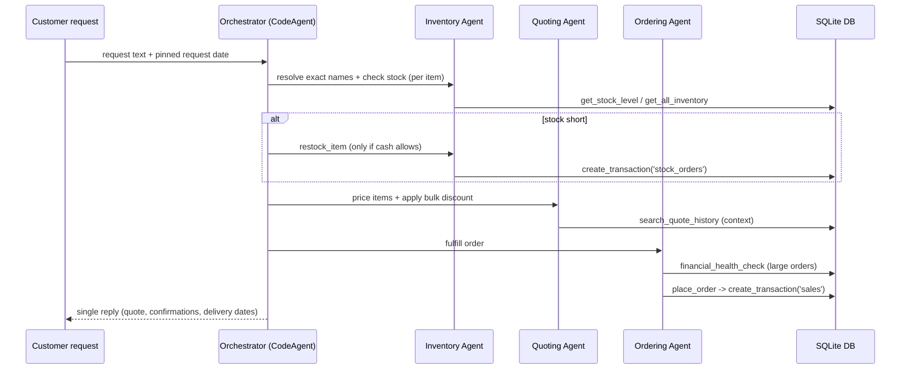

# Beavers Choice Paper — Multi-Agent Workflow Diagram

Framework: **smolagents 1.26.0** · Model: **gpt-4o-mini** (Vocareum OpenAI-compatible proxy)
Agents: **4 total** (1 orchestrator + 3 specialists), within the 5-agent limit. Text-only I/O.

## Agent architecture & data flow

## Per-request sequence

## Key points
- **Exact item names:** `find_catalog_item` maps fuzzy customer wording to catalog names to avoid transaction failures.
- **Authoritative dates:** the request date is pinned in code (`CURRENT_REQUEST_DATE`) so every inventory/cash/sales operation uses the correct date — the LLM cannot substitute a hallucinated date.
- **Bulk discounts:** every quote runs through `calculate_quote` (>=1000 units 15%, >=500 10%, >=100 5%).
- **Full helper coverage:** every utility in `project_starter.py` (lines 74–581) is exercised by an agent tool or at startup.
